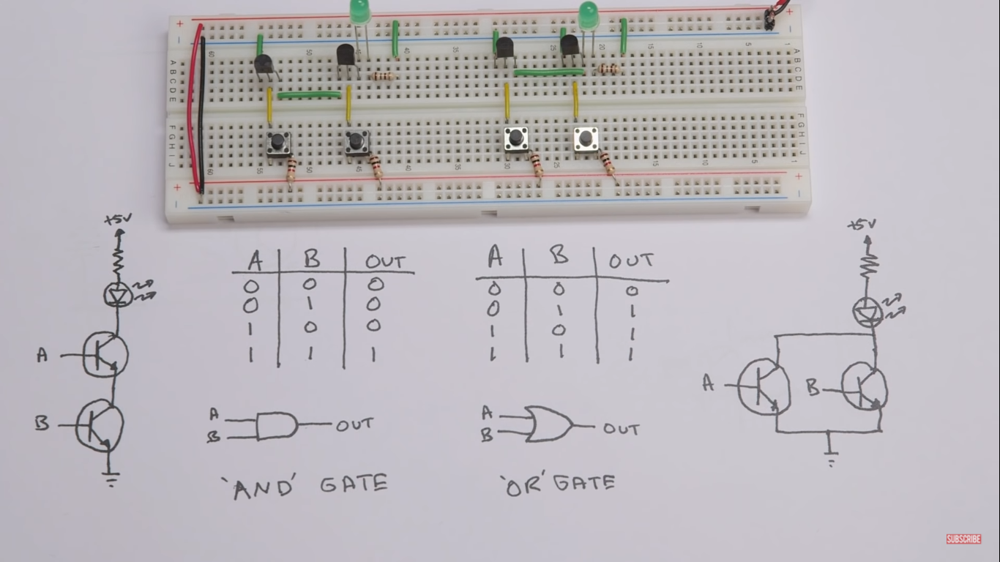
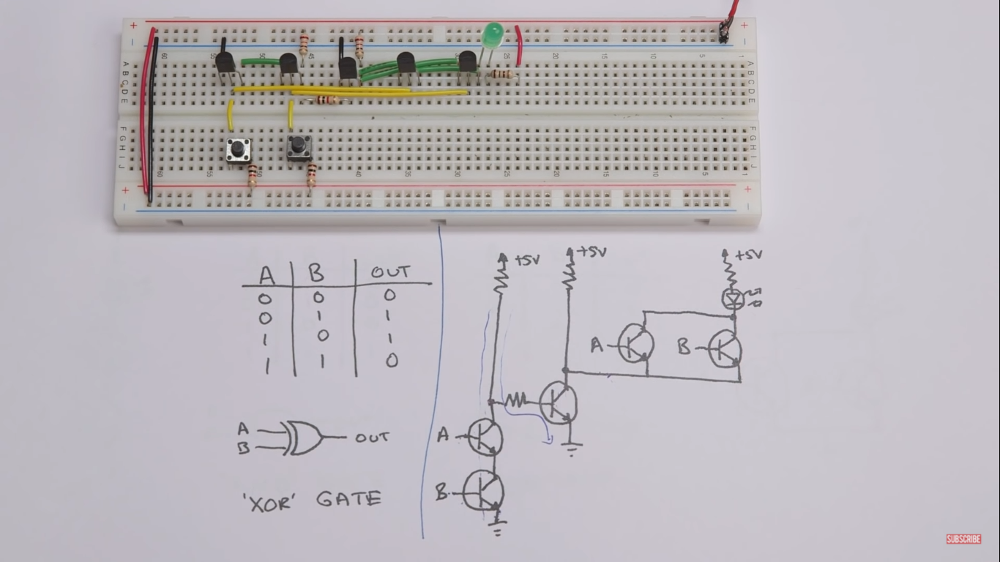
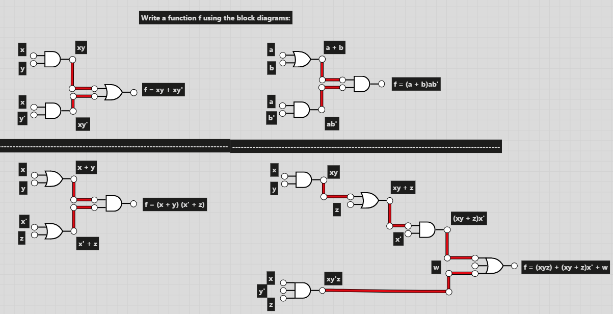
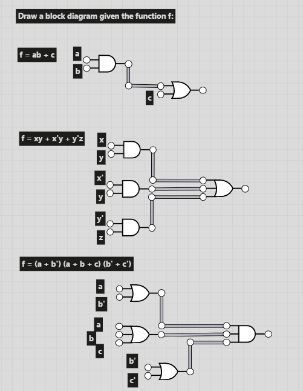

https://youtu.be/JQBRzsPhw2w - **The Organic Chemistry Tutor:** Logic Gates, Truth Tables, Boolean Algebra AND, OR, NOT, NAND & NOR

https://youtu.be/sTu3LwpF6XI - **Ben Eater:** Making logic gates from transistors

# Electronics - Logic Gates
---

 

##### Buffer Gate:
Outputs the same value received for the input.

| $\Alpha$   | Output  |
| :-----:    | :-----: | 
|    0       |    0    |
|    1       |    1    |
 

##### NOT Gate:
Outputs the complementary of $\Alpha$ ($\overline{\rm \Alpha}$).

| $\Alpha$   | Output  |
| :-----:    | :-----: | 
|    0       |    1    |
|    1       |    0    |
 

##### AND Gate:
Receives two inputs $\Alpha$ and $\Beta$ and returns $\Alpha \ast \Beta$.
Finds the *minimun* between binary digits.

*Serial connection between the transistors.*

| $\Alpha$ | $\Beta$  | Output  |
| :-----:  | :-----:  | :-----: | 
|    0     |    0     |    0    |
|    1     |    0     |    0    |
|    0     |    1     |    0    |
|    1     |    1     |    1    |
 

##### OR Gate:
Receives two inputs $\Alpha$ and $\Beta$ and returns $\Alpha + \Beta$.
Finds the *maximum* between binary digits.
*Parallel connection between the transistors.*

| $\Alpha$ | $\Beta$  | Output  |
| :-----:  | :-----:  | :-----: | 
|    0     |    0     |    0    |
|    1     |    0     |    1    |
|    0     |    1     |    1    |
|    1     |    1     |    1    |
 

##### NAND Gate:
Receives two inputs $\Alpha$ and $\Beta$ and returns $\overline{\Alpha \ast \Beta}$.
Can be constructed with an AND gate followed by a NOT gate.
Expression: $\overline{\Alpha \wedge \Beta}$ or $\neg({\Alpha \wedge \Beta)}$ 

| $\Alpha$ | $\Beta$  | Output  |
| :-----:  | :-----:  | :-----: | 
|    0     |    0     |    1    |
|    1     |    0     |    1    |
|    0     |    1     |    1    |
|    1     |    1     |    0    |
 

##### NOR Gate:
Complementary of OR gate.
Receives two inputs $\Alpha$ and $\Beta$ and returns $\overline{\Alpha + \Beta}$.

| $\Alpha$ | $\Beta$  | Output  |
| :-----:  | :-----:  | :-----: | 
|    0     |    0     |    1    |
|    1     |    0     |    0    |
|    0     |    1     |    0    |
|    1     |    1     |    0    |
 

##### XOR Gate:
Receives two inputs $\Alpha$ and $\Beta$ and returns $(\Alpha + \Beta) \ast (\overline{\Alpha} + \overline{\Beta})$.
Return 1/HIGH when the number of **true** inputs is odd.

| $\Alpha$ | $\Beta$  | Output  |
| :-----:  | :-----:  | :-----: | 
|    0     |    0     |    0    |
|    1     |    0     |    1    |
|    0     |    1     |    1    |
|    1     |    1     |    0    |
 

##### XNOR Gate:
Complementary of XOR gate.
Receives two inputs $\Alpha$ and $\Beta$ and returns $(\Alpha \ast \Beta) + (\overline{\Alpha} \ast \overline{\Beta})$.
Return 1/HIGH when both inputs are the same.

| $\Alpha$ | $\Beta$  | Output  |
| :-----:  | :-----:  | :-----: | 
|    0     |    0     |    1    |
|    1     |    0     |    0    |
|    0     |    1     |    0    |
|    1     |    1     |    1    |
 

---

###### Implementation

Screenshots from [Ben Eater's video](https://youtu.be/sTu3LwpF6XI).

---

### Practice

