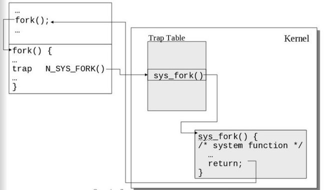
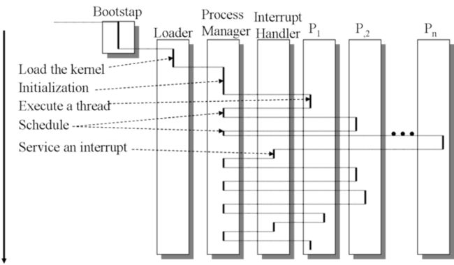

*http://faculty.salina.k-state.edu/tim/ossg/Introduction/OSworking.html*
# ***Operating Systems - Basics***
---

### **Interrupts**
- Interrupts are signals sent to the CPU by external devices (usually I/O devices). They make the CPU stop what it's currently doing to immediately perform the requested action. Interrupts have three types:
    - **Hardware interrupt:** Generated by *hardware devices* to signal that they need attention from the OS. The device may have received data or completed some task requested to it by the OS, like transfering data between drives.
    - **Software interrupt:** Generated by programs when they want to request a system call to be performed by the operating system.
    - **Traps**: Generated by the CPU itself to indicate that some error or condition occured for which assistance from the OS is needed.

---

### **CPU Execution Mode**
A system call (syscall) will switch the *mode bit* to kernel mode, as well as traps and interrupts, but not application programs.

#### **User mode:** 
Restricted mode. Cannot execute certain instructions, access certain registers and I/O devices.

#### **Kernel mode:**
Also called Supervisor mode, has none of the above mentioned restrictions. Being able to execute and reference every instruction and memory locations.

### **CPU response to interrupts**
***Context Switching:*** Switch of running processes to execute OS kernel code.  
To perform an interrupt, the CPU relies on **two registers**:  
- One which stores a pointer to the current process's [**control block** (PCB)](#5-pcb).
- The other one stores a pointer to a **table of pointers** to the instructions in the kernel for the interrupt handlers and syscalls. The value of this register and the values in the table are set when the system initializes. The **interrupt vector table** is normally located in the first 1024 bytes of memory at addresses 000000H–0003FFH. It contains 256 different **interrupt vectors**. Interrupt vectors are 4-byte addresses that inform the interrupt handler as to where to find the ISR (Interrupt Service Routine).

**CPU actions in response to interrupts:**
1. Saves the state and register values of the to-be-interrupted process using the pointer to it's **control block**.
2. Switches the CPU mode bit to *supervisory mode*.
3. Finds the kernel code to execute using the pointer to the **interrupt vector table** and the **interrupt vector**. The interrupt vector is the **Interruption Request Line** (IRQ) for [*hardware interrupts*](#interrupts) and an argument to the **interrupt assembly instruction** for [*software interrupts*](#interrupts).
4. Processing is switched to the appropriate part of the kernel.

Software interrupt.
 

Process switching.
 

### Tasks of an OS
1. **Process Management:** The OS is responsible for managing the resource allocation for every running process as well as providing syscalls to manage those processes;
2. **Memory Management:** The OS must manage the allocation of memory to processes and control the memory management hardware that determines which memory locations a process may access.
3. **File System Management:** The OS provides primitives for transmitting, processing and storing file system objects.
4. **Device Management:** Processes access I/O devices using the system call interface. The OS tries to manage said devices in a manner that makes them efficiently shared among all processes requiring them. A system call is a programming interface to the services provided by the OS, typically written in C/C++.

---

<h5 id='5-pcb'>Process Control Blocks</h5>
A data structure in the OS kernel’s memory holding all data that the OS needs about a process. All of the process control blocks are kept in an array indexed by the PID for each process.
