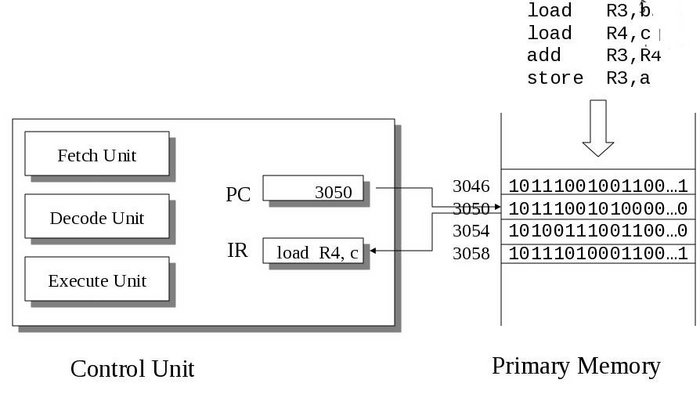

# ***John von Neumann - Computer Architecture***
###### ***http://faculty.salina.k-state.edu/tim/ossg/Introduction/compArch.html***
---
For a machine to be a computer, it *must* have the following:

1. Adressable memory that holds both instruction and data;
2. Arithmetic logic unit (ALU);
3. Program counter;
   
---

### **CPU (Central Processing Unit)**
- Engine of the computer. Executes programs.

### **ALU (Arithmetic Logic Unit)**
- Part of the CPU. Executes individual instructions involving data (operands).

### **Register**
- A memory location in the CPU which holds a fixed amount of data. Currently, most systems hold 64 bits (8 bytes) worth of data.

    #### **Program Counter / Instruction Pointer**
    - Register which holds the memory adress of the instruction being executed.

    #### **Instruction Register**
    - Register which holds the current instruction being executed.

    #### **Accumulator**
    - A register designated to hold the result of an operation performed by the ALU.

    #### **Register File**
    - A collection of several registers
</br>  

## **CPU Control Unit**  
---
    LOAD    R3, b       # Loads the value of b into the Register3
    LOAD    R4, c       # Loads the value of c into the Register4
    ADD     R3, R4      # Add the values of R3 and R4 
    STORE   R3, a       # Store the sum result in a



<br/>

## **The von Neumann Loop**  
---
### **Fetch phase**
- Retrieve the next instruction and store it in the **instruction register**.

### **Execute phase**
- The ALU or I/O unit executes the instruction:
    - ALU does calculations.
    - I/O unit loads or stores data between main memory and registers.

```
PC = <machine start address>;       # Sets the Program counter to initial address
IR = memory[PC];                    # Sets the PC current instruction into the Instruction Register 
haltFlag = CLEAR;                   
while(haltFlag not SET) {  
    execute(IR);                    # Executes whatever is stored in the IR
    PC = PC + sizeof(INSTRUCT);     # Increase PC pointer address (current address + instruction size)
    IR = memory[PC];                # Retrive next instruction (fetch phase)  
};  
```

